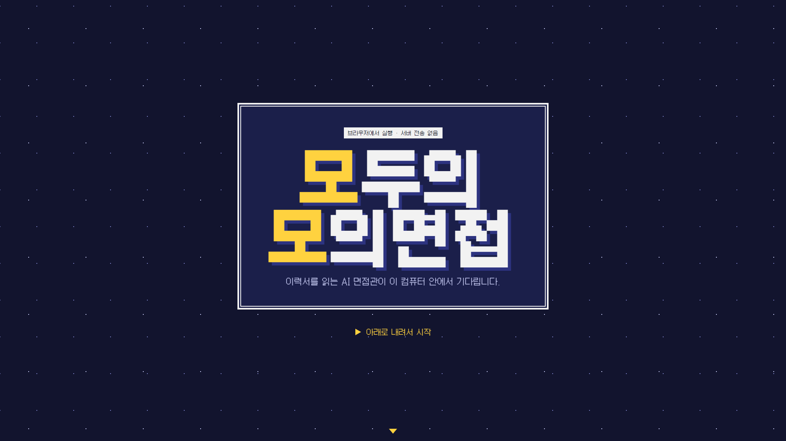
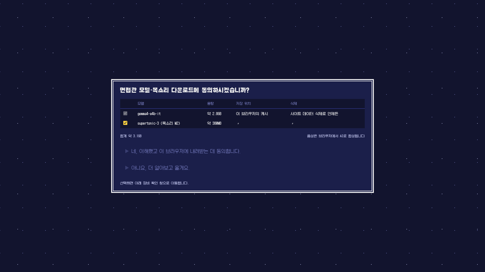
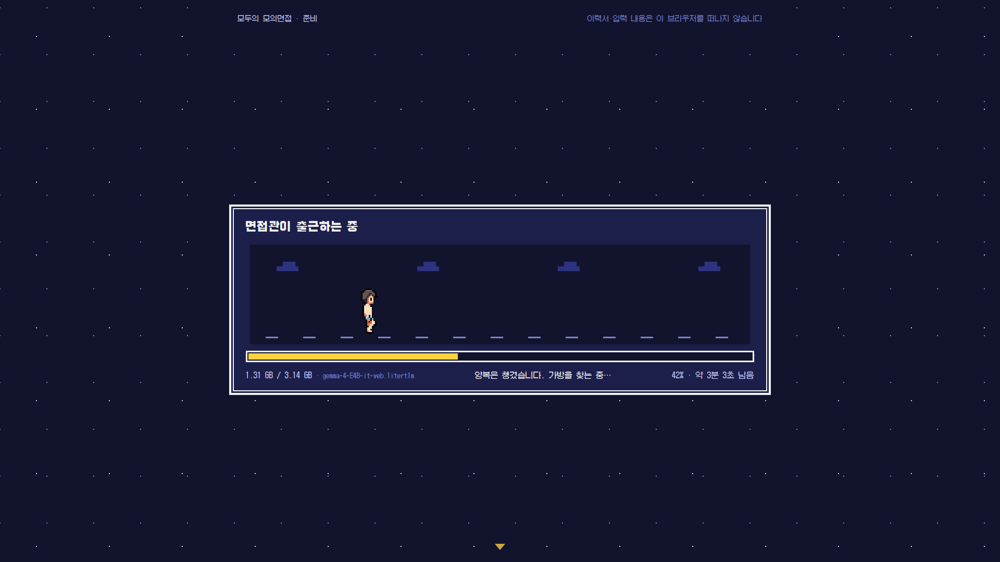
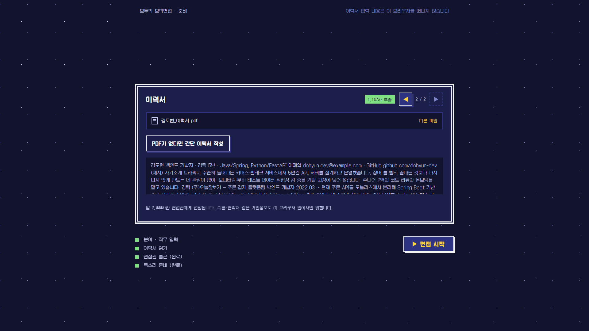
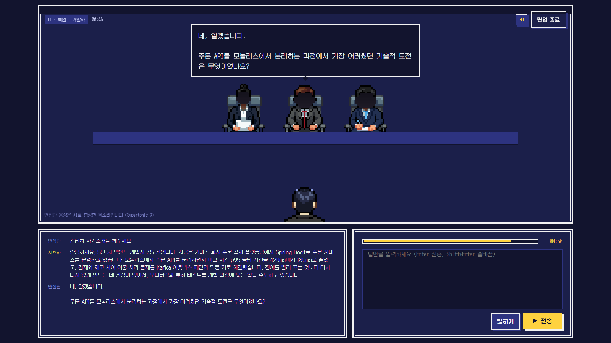
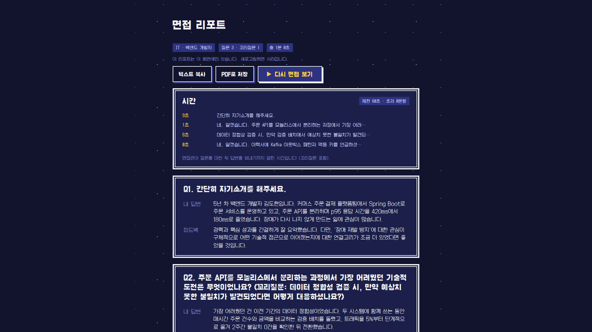

# 모두의 모의면접

**이력서가 내 컴퓨터를 떠나지 않는, 브라우저 속 AI 면접관**

- 서비스: **https://momo.ssenu.cloud**
- 원티드 AI 활용 공모전 출품작



## 해결하고자 한 문제

AI 모의면접을 하려면 이력서와 답변 같은 민감한 개인정보를 외부 서버에 넘겨야 합니다. 이 문제를 **모든 AI 추론을 사용자 브라우저 안에서 실행**하는 방식으로 풀고자 했습니다.

- 이력서(이름·연락처·학력·경력)는 취업 준비생에게 가장 민감한 개인정보입니다. 서버에 올리는 순간 어디에 저장되고 어떻게 쓰이는지 사용자가 알기 어렵습니다.
- 사람과 하는 모의면접은 비용과 시간이 들고, 원할 때 반복하기 어렵습니다.
- 점수보다 **답변마다 무엇을 고쳐야 하는지**가 연습에 더 도움이 됩니다.

## 어떻게 동작하나요

1. **동의하고 내려받기**: 면접관 모델(Gemma 4, 약 2.8GB)과 목소리 모델(Supertonic 3, 약 380MB)을 브라우저 캐시에 한 번만 받습니다. 목소리는 빼고 텍스트로만 할 수도 있습니다. 두 번째 방문부터는 다시 받지 않습니다.
2. **이력서 넣기**: PDF를 올리면 브라우저 안에서 글자를 뽑습니다. PDF가 없으면 간단 이력서 양식으로 작성합니다.
3. **면접 보기**: 가운데 면접관이 이력서를 바탕으로 질문 5개를 하고, 답변이 흥미로우면 꼬리질문을 합니다. 면접관 목소리는 브라우저에서 합성합니다. 답은 글로 치거나 말로 할 수 있습니다.
4. **리포트 받기**: 점수 대신 문항별로 **내 답변 원문과 피드백**을 보여 줍니다. 답변마다 걸린 시간도 표로 정리합니다. 텍스트 복사와 PDF 저장을 지원합니다.

| 다운로드 동의 | 모델 내려받기 |
|---|---|
|  |  |
| **이력서 넣기** | **면접** |
|  |  |



### 개인정보 설계
- 서버(FastAPI)는 **모델 목록(매니페스트), 분야별 예비 질문, 상태 확인** 세 가지만 제공합니다. 이력서·대화·리포트를 받는 API는 처음부터 만들지 않았습니다.
- 면접관 LLM, 목소리 합성, PDF 읽기는 모두 브라우저 안에서 실행됩니다. 모델 파일은 Hugging Face 원본에서 브라우저가 직접 받습니다.
- 리포트는 그 화면에만 있고, 새로고침하면 사라집니다.
- 참고: 마이크 입력은 현재 Chrome 음성 인식(Web Speech API)을 사용합니다. 기기 안(온디바이스) 인식으로 바꾸는 작업을 진행 중입니다([#43](https://github.com/4thIS/Woo-MoMo-Project/issues/43)). 텍스트 입력은 서버로 가지 않습니다.

## AI 활용 방식 및 결과

### 서비스 안의 AI

Gemma 4와 Supertonic 3 TTS를 WebGPU로 브라우저 안에서 실행해, 이력서를 읽고 질문·꼬리질문을 하는 AI 면접관을 만들었습니다.

| 역할 | 모델·기술 | 실행 위치 |
|---|---|---|
| 면접관(질문·꼬리질문·리포트) | Google **Gemma 4 E4B**. GPU가 부족하면 E2B로 전환 | 브라우저, LiteRT-LM + WebGPU |
| 면접관 목소리 | **Supertonic 3** TTS(한국어 목소리 M2) | 브라우저 웹 워커, onnxruntime-web WebGPU |
| 이력서 읽기 | pdf.js | 브라우저 |
| 답변 입력 | 텍스트, 또는 Web Speech API 음성 인식(말을 멈추면 3초 뒤 자동 전송) | 브라우저 |

### 개발 과정의 AI — Claude Code로 2인 협업

- **협업 규칙:** 직접 만든 `project-init` 스킬로 공통 규칙(`CLAUDE.md`), 프론트·백엔드 영역 분리, CI, PR 템플릿을 세웠습니다.
- **설계·계획:** superpowers의 `brainstorming`으로 설계서를, `writing-plans`로 작업 계획서를 먼저 확정했습니다(`docs/specs`, `docs/plans`).
- **구현·리뷰:** `subagent-driven-development`로 에이전트가 테스트를 먼저 작성하는 방식(TDD)으로 구현하고, 다른 에이전트가 리뷰했습니다.
- **그래픽:** 면접관·지원자 등 2D 픽셀 그래픽은 Claude Code에서 PixelLab MCP로 만들었습니다.
- **디버깅·운영:** 배포 뒤 생긴 장애(TTS 모듈 MIME·브라우저 캐시 문제 등)도 원인을 추적해 이슈와 PR로 해결했습니다. 상대 영역의 작업은 코드 근거를 담은 이슈로 넘겼습니다.

### 결과
- 이슈·PR 약 40건, 테스트 약 410개를 거쳐 https://momo.ssenu.cloud 에 배포했습니다.
- Intel GPU 노트북 실측
  - 면접 시작 후 첫 질문까지 약 5초
  - 답변 뒤 꼬리질문(생성 + 음성)까지 약 13초
  - 리포트 생성 약 16초
  - 51자 음성 합성 약 0.3~0.4초
- 모델 다운로드 경로를 개인 서버에서 Hugging Face로 바꿔 내려받기 속도가 약 11MB/s에서 약 27MB/s로 빨라졌습니다(같은 PC 실측).

## 기술 스택

| 영역 | 사용 기술 |
|---|---|
| 프론트엔드 | Vue 3, Vite, TypeScript, Pinia, pdf.js, Web Speech API |
| 브라우저 AI | Gemma 4 (LiteRT-LM, WebGPU), Supertonic 3 (onnxruntime-web, WebGPU) |
| 백엔드 | FastAPI (Python 3.12, uv, pydantic) |
| 배포 | Docker Compose, nginx, GitHub Actions(arm64 이미지), Raspberry Pi, Cloudflare Tunnel |
| 모델 호스팅 | Hugging Face (커밋 고정 주소) |
| 개발 도구 | Claude Code (superpowers, project-init 스킬), PixelLab MCP |

```
브라우저 ─┬─ Gemma 4 (WebGPU) ── 질문·꼬리질문·리포트
          ├─ Supertonic 3 (WebGPU 워커) ── 면접관 목소리
          ├─ pdf.js ── 이력서 텍스트 추출
          ├─ Cache API ── 모델 파일 보관(재방문 시 다시 받지 않음)
          │
          ├── huggingface.co ── 모델 파일 다운로드(처음 한 번)
          └── momo.ssenu.cloud (nginx + FastAPI) ── 화면·매니페스트·예비 질문만
```

## 로컬에서 실행하기

필요한 것: Node 22와 pnpm, Python 3.12와 [uv](https://docs.astral.sh/uv/), WebGPU를 지원하는 최신 Chrome 또는 Edge

```bash
# 백엔드 (http://localhost:8000)
cd backend
uv sync
uv run uvicorn app.main:app --reload

# 프론트엔드 (http://localhost:5173, /api는 백엔드로 프록시)
cd frontend
pnpm install
pnpm dev
```

- 모델 파일은 매니페스트의 Hugging Face 주소에서 브라우저가 직접 받으므로 따로 준비할 필요가 없습니다.
- 테스트: `cd backend && uv run pytest -q`, `cd frontend && pnpm test`
- 라즈베리파이 배포: [`deploy/README.md`](deploy/README.md)

## 문서

| 문서 | 내용 |
|---|---|
| [`CLAUDE.md`](CLAUDE.md) | 협업 규칙(역할, 계층 규율, 커밋·PR 규칙) |
| [`docs/superpowers/specs/2026-09-15-mock-interview-design.md`](docs/superpowers/specs/2026-09-15-mock-interview-design.md) | 전체 설계서 |
| [`docs/API.md`](docs/API.md) | 백엔드 API 계약(매니페스트·예비 질문·헬스체크) |
| [`docs/specs/`](docs/specs), [`docs/plans/`](docs/plans) | 영역별 설계서·작업 계획서 |
| [`docs/demo-checklist.md`](docs/demo-checklist.md) | 데모 리허설 체크리스트 |
| [`docs/licenses/NOTICE.md`](docs/licenses/NOTICE.md) | 서드파티 고지 |

## 팀

| 이름 | 역할 |
|---|---|
| 박찬우 [@ssenu](https://github.com/ssenu) | 백엔드·API 계약·배포 |
| 이몬타 [@leemonta9482](https://github.com/leemonta9482) | 프론트엔드·브라우저 AI 실행·음성·픽셀 그래픽 |

## 라이선스 고지

- Gemma 4: [Gemma Terms of Use](https://ai.google.dev/gemma/terms) (Hugging Face `litert-community`)
- Supertonic 3: BigScience OpenRAIL-M (Supertone Inc.). 면접관 음성이 AI 합성 음성임을 화면에 표시합니다.
- 자세한 내용: [`docs/licenses/NOTICE.md`](docs/licenses/NOTICE.md)
